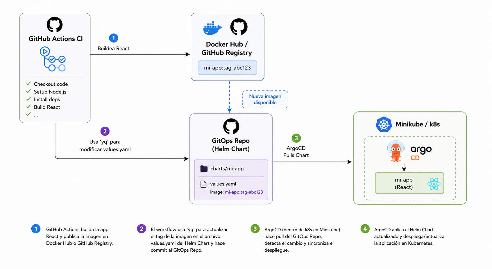

i# 🚀 Reto GitOps - Día 2/10: GitHub Actions + Helm + ArgoCD

> **Pipeline GitOps moderno con CI desacoplado del CD utilizando GitHub Actions, Helm y ArgoCD sobre Kubernetes.**

> 

---

## 📖 Introducción

En muchos proyectos tradicionales, el pipeline termina ejecutando comandos como `kubectl apply` directamente desde la herramienta de CI. Aunque funciona, este enfoque acopla el proceso de integración continua con el despliegue y dificulta la auditoría, la trazabilidad y la recuperación del estado del clúster.

En este proyecto implementamos una **arquitectura GitOps de nivel empresarial**, donde:

- ✅ **GitHub Actions** únicamente construye y publica artefactos.
- ✅ **Git** se convierte en la única fuente de verdad (*Single Source of Truth*).
- ✅ **ArgoCD** es el único responsable de desplegar cambios en Kubernetes.
- ✅ Todo el flujo ocurre **sin intervención humana**, de forma declarativa y reproducible.

El resultado es un pipeline moderno, desacoplado y alineado con las mejores prácticas utilizadas en entornos productivos.

---

# 🏗️ Arquitectura del Sistema

## Flujo completo

### 🔹 1. Integración Continua (CI)

Cada vez que se realiza un **Push** sobre la rama **main** del repositorio **app-repo**, se ejecuta automáticamente un workflow de **GitHub Actions**.

Durante la ejecución ocurre lo siguiente:

1. Se obtiene el **Short SHA** del commit actual.
2. Se construye una imagen Docker optimizada basada en **Nginx Alpine**.
3. La imagen se publica automáticamente en **Docker Hub**.
4. Se utiliza la herramienta **yq** para modificar el archivo:

```text
charts/nginx-app/values.yaml
```

actualizando el tag de la imagen recién publicada.

Finalmente, GitHub Actions realiza un commit automático sobre el repositorio de infraestructura con el nuevo tag generado.

---

### 🔹 2. Despliegue Continuo (CD)

Una vez actualizado el repositorio **infra-repo**, entra en acción **ArgoCD**.

ArgoCD monitorea continuamente dicho repositorio y detecta automáticamente el cambio realizado en el Helm Chart.

Cuando identifica una diferencia entre el estado deseado (Git) y el estado actual del clúster:

- sincroniza la aplicación,
- descarga el nuevo Helm Chart,
- aplica los cambios,
- despliega los nuevos Pods en Minikube,

todo ello **sin ejecutar un solo comando manual**.

De esta manera, Git pasa a representar el estado deseado del sistema y Kubernetes permanece constantemente reconciliado con él.

---

# ⚙️ Flujo resumido

```text
Developer
     │
     ▼
Push a main (app-repo)
     │
     ▼
GitHub Actions
     │
     ├── Obtener Short SHA
     ├── Build Docker Image
     ├── Push a Docker Hub
     └── Actualizar charts/nginx-app/values.yaml usando yq
                    │
                    ▼
          Commit automático a infra-repo
                    │
                    ▼
               ArgoCD detecta cambios
                    │
                    ▼
          Sincroniza Helm Chart
                    │
                    ▼
         Kubernetes (Minikube actualizado)
```

---

# 📂 Estructura del Proyecto

Este repositorio funciona como un **Repositorio Paraguas**, cuyo objetivo es agrupar los distintos componentes del pipeline GitOps.

Los directorios **app-repo** e **infra-repo** son **submódulos vivos de Git**, lo que significa que cada uno mantiene su propio historial, ramas y ciclo de vida independiente.

```text
gitops-day2/
│
├── app-repo/                # Código fuente + Pipeline CI
│
├── infra-repo/              # Repositorio GitOps
│   └── charts/
│       └── nginx-app/
│           ├── Chart.yaml
│           ├── values.yaml
│           └── templates/
│
├── argocd-helm-app.yaml     # Aplicación de ArgoCD
│
└── README.md
```

---

# 📋 Requisitos Previos

Antes de comenzar asegúrate de contar con:

- ✅ Minikube instalado y funcionando.
- ✅ Clúster Kubernetes operativo con ruteo habilitado.
- ✅ ArgoCD instalado dentro del clúster.
- ✅ Docker Hub.
- ✅ Cuenta de GitHub.
- ✅ Git instalado.
- ✅ Helm instalado (opcional para pruebas locales).

---

# 🔐 Configuración de Repository Secrets

Para que el pipeline funcione correctamente es indispensable configurar los siguientes **Repository Secrets** dentro del repositorio **app-repo**.

Ir a:

```text
Settings
   └── Secrets and variables
          └── Actions
```

Crear los siguientes secretos.

---

## DOCKERHUB_USERNAME

Usuario de Docker Hub.

Ejemplo:

```text
jmartinezsh
```

---

## DOCKERHUB_TOKEN

Access Token generado desde:

```text
Docker Hub
    └── Account Settings
            └── Security
                    └── New Access Token
```

Permisos recomendados:

- Read
- Write

Este token será utilizado para publicar automáticamente las imágenes Docker.

---

## GITOPS_GITHUB_TOKEN

Personal Access Token (PAT) de GitHub.

Debe tener permisos suficientes para escribir en el repositorio de infraestructura.

Permisos mínimos recomendados:

```text
contents: write
```

Este token permite que GitHub Actions actualice automáticamente el archivo:

```text
charts/nginx-app/values.yaml
```

y realice el commit correspondiente en **infra-repo**.

---

# 🚀 Despliegue Local

## 1. Clonar el repositorio

Como este proyecto utiliza **Git Submodules**, es importante clonarlo utilizando el flag `--recursive`.

```bash
git clone --recursive https://github.com/usuario/gitops-day2.git
```

---

## ¿Ya lo clonaste sin submódulos?

Puedes inicializarlos ejecutando:

```bash
git submodule update --init --recursive
```

---

## 2. Aplicar la aplicación de ArgoCD

Crear la aplicación dentro del clúster:

```bash
kubectl apply -f argocd-helm-app.yaml
```

A partir de ese momento, ArgoCD comenzará a monitorear automáticamente el repositorio de infraestructura.

---

# 🔄 Resultado esperado

Una vez configurado el pipeline:

```text
Push
   │
   ▼
GitHub Actions

   │

Docker Build

   │

Docker Hub

   │

Actualización de values.yaml

   │

Commit automático

   │

ArgoCD detecta cambio

   │

Sync

   │

Nuevo Deployment en Kubernetes
```

Todo el proceso ocurre automáticamente y sin intervención manual.

---

# 💡 Filosofía de Desarrollo

> **Importante:** Los commits automáticos realizados por el pipeline GitOps deberían incluir el flag **`[skip ci]`** en el mensaje del commit. Esta práctica evita que los cambios generados por el propio pipeline vuelvan a disparar nuevas ejecuciones de CI/CD, previniendo bucles infinitos, reduciendo el consumo innecesario de recursos y manteniendo un flujo de automatización limpio y predecible. Es una buena práctica ampliamente adoptada en entornos empresariales.

---

# 🎯 Objetivos alcanzados

- ✅ Pipeline CI completamente automatizado.
- ✅ Build de imágenes Docker optimizadas.
- ✅ Versionado mediante Short SHA.
- ✅ Publicación automática en Docker Hub.
- ✅ Actualización automática de `charts/nginx-app/values.yaml`.
- ✅ GitOps desacoplado mediante repositorio de infraestructura.
- ✅ Despliegue automático utilizando ArgoCD.
- ✅ Sin intervención manual sobre Kubernetes.

---

## 📅 Reto GitOps

Este repositorio corresponde al **Día 2 de un reto de 10 días**, donde se construyen progresivamente pipelines CI/CD modernos utilizando herramientas del ecosistema Cloud Native.

En las próximas entregas se incorporarán nuevas capacidades como validaciones, seguridad, observabilidad, promoción entre entornos y despliegues avanzados siguiendo las mejores prácticas DevOps.
